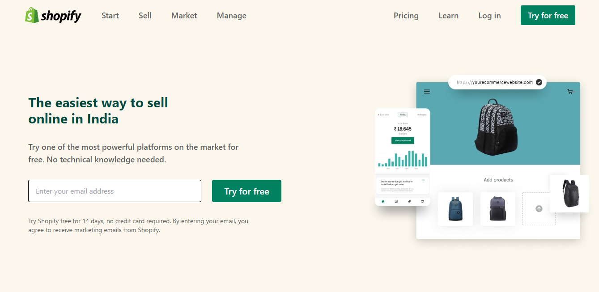

## ⭐Responsive Shopify Clone Using Tailwind CSS⭐

 

## 📌 Live Site URL: <a href="https://responsive-shopify-clone-using-tailwind-css.vercel.app/">**Visit Now**</a>

 

## 📌 Screenshot:

 

## 📌 What I Learned:

- ### Creating responsive website using Tailwind breakpoints
- ### Explored Tailwind documnetation
- ### Sticky nav bar in Tailwind
- ### Flexbox properties in Tailwind

 

## 📌 Time Taken To Complete This Project:

- ### Took me almost 2 days to make it

 

## 📌 Social Links:

